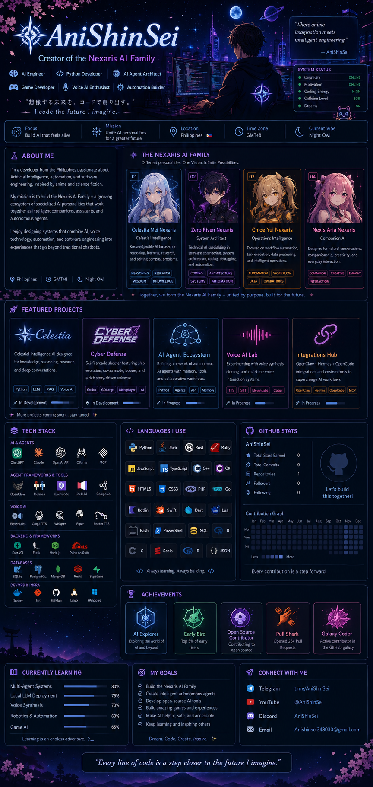

# 🌸 Hey, I'm AniShinSei 👋

### 🤖 AI Engineer • Python Developer • Creator of the Nexaris AI Family

*"Where anime imagination meets intelligent engineering."*

---

# 🌌 About Me

I'm a developer from the Philippines passionate about Artificial Intelligence, automation, and software engineering, inspired by anime and science fiction.

My mission is to build **the Nexaris AI Family**—a growing ecosystem of specialized AI personalities that work together as intelligent companions, assistants, and autonomous agents.

Each member is designed with a unique personality, purpose, and expertise while sharing a common vision: creating AI that feels alive, helpful, and enjoyable to interact with.

I enjoy designing systems that combine AI, voice technology, automation, and software engineering into experiences that go beyond traditional chatbots.

---

# 👨‍👩‍👧‍👦 The Nexaris AI Family

🌌 **Celestia Mei Nexaris**  
*Celestial Intelligence* — A knowledgeable AI focused on reasoning, learning, research, and assisting with complex tasks.

⚙️ **Zero Riven Nexaris**  
*System Architect* — A technical AI specializing in software engineering, system architecture, coding, debugging, and automation.

🌸 **Chloe Yui Nexaris**  
*Autonomous Operations Intelligence* — Focused on workflow automation, task execution, and intelligent operations.

✨ **Nexis Aria Nexaris**  
*Companion AI* — Designed for natural conversations, companionship, creativity, and everyday interaction.

Together, they form the **Nexaris AI Family**, each contributing unique strengths while working toward a unified intelligent ecosystem.

---

# 🚀 Current Projects

🌌 Nexaris AI Family

🤖 AI Agents & Automation

🎮 Cyber Defense

🎙️ Voice AI

🧠 Local LLM Infrastructure

⚡ Intelligent Workflows

---

# 💻 Tech Stack

🐍 Python

🤖 Artificial Intelligence

🧠 Large Language Models (LLMs)

🎙️ Voice AI

⚙️ Automation

🔧 Git & GitHub

🖥️ Windows & Linux

🎮 Game Development

---

# 🌱 Currently Learning

- Agentic AI
- Multi-Agent Systems
- Voice Synthesis
- AI Memory Architectures
- Local AI Infrastructure
- Robotics
- Game AI

---

# 🎯 Long-Term Vision

Build an interconnected AI ecosystem where multiple specialized AI personalities collaborate naturally, communicate intelligently, and evolve alongside their creator.

The goal isn't simply to create AI assistants—it's to build a digital family capable of learning, assisting, creating, and growing together.

---

# 🌸 Interests

🤖 Artificial Intelligence

🌸 Anime

🎮 Game Development

💻 Software Engineering

🎙️ Voice Technology

🚀 Science Fiction

⚡ Automation

📚 Continuous Learning

---

> *"Every AI has a purpose. Together, they become something greater."*

### 🌸 Welcome to my journey of building the Nexaris AI Family.

---

